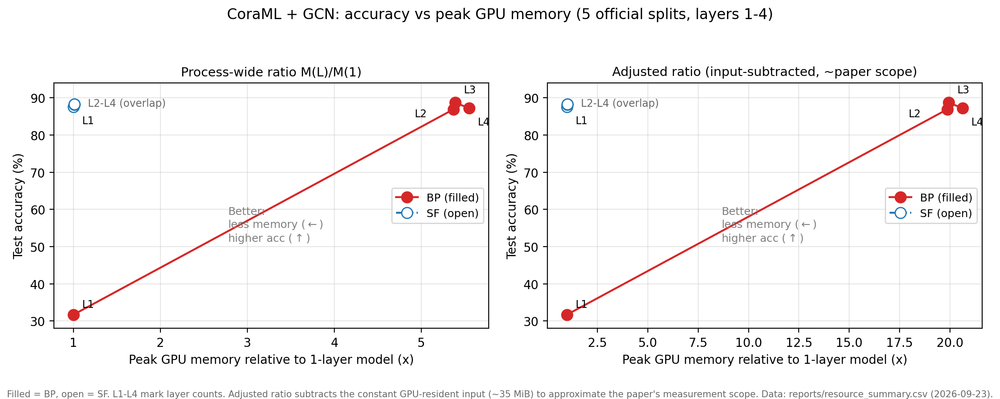
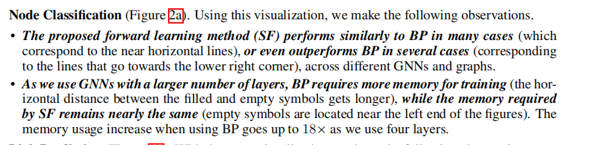
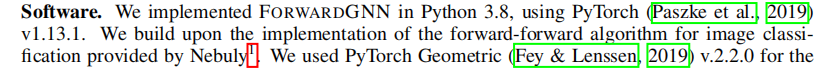
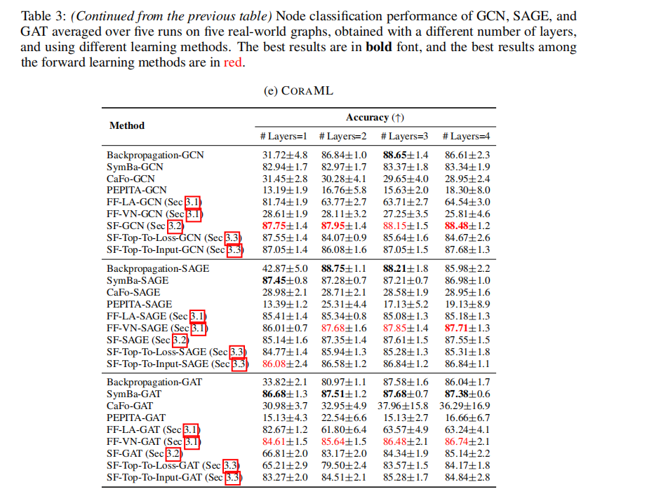
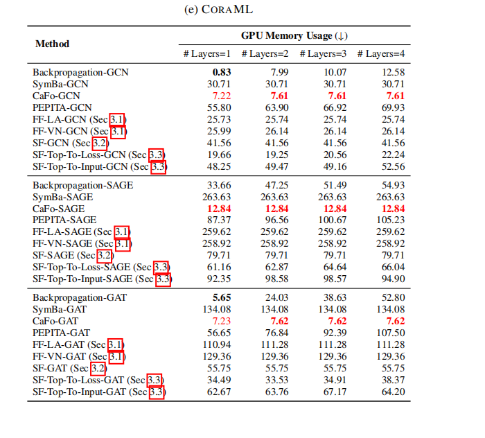

# ForwardGNN 复现阶段性报告

## 1. 结论摘要

1. **结果对齐**：按论文协议（官方代码、官方数据划分、1000 epochs、5 个官方划分重复）在 CoraML + GCN 上完成 SF/BP 对照，两层 BP **86.88±0.98**（论文 86.84±1.0，差 +0.04 pp）、两层 SF **88.11±1.22**（论文 87.95±1.4，差 +0.16 pp），均达到事先约定的对齐判据（差 ≤1.0 pp 且落在论文 ±2σ 内）。
2. **深度扩展全部对齐**：1–4 层 × 两方法共 8 组配置，测试准确率与论文 Table 3(e) 全部差 ≤0.6 pp；其中 1 层 BP 与论文**逐位一致**（31.72±4.80）。
3. **论文核心主张复现**：SF 的峰值显存不随层数增长（1–4 层恒定 **1.01–1.02×**），BP 显著增长（相对自身 1 层 5.55×，近似论文口径 **20.6×**）——与论文 Figure 2a / Table 4 的趋势一致，已绘制同风格对比图。

图说明：

1. **蓝圈（SF）四个深度几乎完全重叠在 (1×, ~88%)** ：2、3、4 层模型的显存和 1 层几乎一样，准确率也稳定——这就是论文标题级的主张“SF 显存不随深度增长”的直观形态。图上标的 "L2-L4 (overlap)" 不是画图失误，重叠本身就是结论。
2. **红线（BP）从左下爬到右上** ：1 层又省显存又差准（31.7%），加到 2 层后显存跳到 5.4×（右图修正口径 20×），准确率升到 87–88%——BP 用显存换精度，且换得越来越多。
3. **在 L2–L4 区间，SF 的点位于 BP 的左上方** ：SF 用**不增长的显存**达到了 **相当甚至更高的准确率** ——这正是论文摘要里 "more scalable in memory usage" 那句话。



论文 §4.2 第 7 页提出的两条观察，我们在  **CoraML + GCN 这一组合上验证成立** ：SF 四个深度显存恒定 1.01×、准确率 2–4 层高于 BP；BP 显存修正口径增长 20.6×，与论文所述量级（GCN 组合 ≈15×，全组合最大 18×）一致。全称结论的其余组合属于步骤 8 待扩展范围

1. **结论边界**：以上是"CoraML + GCN"这一论文子实验的结果对齐，**不等于整篇论文复现完成**

## 2. 复现对象与协议

| 项目     | 内容                                                                                                                                                                                                                   |
| -------- | ---------------------------------------------------------------------------------------------------------------------------------------------------------------------------------------------------------------------- |
| 论文     | ICLR 2024，官方代码 facebookresearch/forwardgnn（本仓库快照逐文件 SHA-256 校验）（环境配置参考下图论文原文及官方代码里的install_package.sh)                                                                            |
| 首个目标 | 论文 §4.2 / Table 3(e)：CoraML 节点分类，SF-GCN vs BP-GCN，2 层；后扩展至 1–4 层                                                                                                                                     |
| 方法     | SF（单前向，论文 §3.2）与 BP 基线；对照 Table 1 概括值不作为两层 GCN 的专属目标                                                                                                                                       |
| 数据     | CitationFull-Cora_ML（2,995 节点 / 2,879 特征 / 7 类 / 16,316 有向边条目 = 论文 Table 2）；**官方数据划分**（github.com/NamyongPark/forwardgnn-datasplits，64%/16%/20%，5 组）                                   |
| 训练协议 | 隐藏维 128，Adam lr=1e-3、wd=5e-4，epochs=1000，val-every=2，patience=100（按验证次数计），5 次运行 =**5 个官方划分**（run_i 即 split_i，种子 = 100×101+run_i×3 = 10100…10112），SF 的 τ=1.0、虚拟节点边双向 |
| 对齐判据 | 看结果前预先约定（协议 §8.2）：差 ≤1.0 pp 且在论文 ±2σ 内为"与论文一致"；1–3 pp 为"趋势一致"；>3 pp 为"未对齐"                                                                                                    |



## 3. 环境与材料

| 项目          | 配置                                                                                                                                    |
| ------------- | --------------------------------------------------------------------------------------------------------------------------------------- |
| 宿主 / 子系统 | Windows 11 + WSL2，Ubuntu 26.04（内核 6.18 microsoft-standard-WSL2）                                                                    |
| GPU           | NVIDIA RTX 4060 Laptop 8 GB，驱动 560.94（sm_89，经 PTX JIT 运行，实测正常）                                                            |
| 软件          | Python 3.8.20、PyTorch 1.13.1（CUDA 11.7 运行时）、PyG 2.2.0、numpy 1.19.2、scipy 1.6.2、scikit-learn 1.2.1；matplotlib 3.6.3（仅绘图） |
| 必需环境变量  | `CUBLAS_WORKSPACE_CONFIG=:4096:8`（官方代码启用确定性算法，CUDA 下缺此变量会直接报错；实测确认）                                      |
| 目录          | `~/forwardgnn-run/`：官方代码的逐字节校验运行副本（训练产生的 data/results 都在此，快照不污染）                                       |

与论文硬件（H100 / CentOS）的差异及处理：显存**绝对值**不可直接比较，一律比较相对比例与趋势（协议 §6 事先约定）。

## 4. 实施过程

| 步骤         | 内容与关键动作                                                                                                             |
| ------------ | -------------------------------------------------------------------------------------------------------------------------- |
| 1 协议锁定   | 目标、映射表（论文方法 ↔ 代码文件 ↔ 启动脚本 ↔ 模型名）、超参数逐项核对（论文 App.B ↔ 脚本 ↔ 代码）、对齐判据预先固定 |
| 2 环境       | WSL2 conda 环境按官方安装脚本原样搭建；GPU kernel、两入口`--help`、device 解析验证                                       |
| 3 数据审计   | CoraML 维度与论文 Table 2 一致；5 组划分两两互斥、并集=全节点；15 个划分文件 SHA-256 存档                                  |
| 4 运行复现   | BP/SF 各 20 epoch 短跑跑通全流程（先 BP 后 SF）；发现并固化`CUBLAS_WORKSPACE_CONFIG` 要求                                |
| 5 方法检查   | 18 项 SF 行为断言全部通过（详见 §5.3）                                                                                    |
| 6 正式对照   | E02/E03：两层、5 划分、论文协议                                                                                            |
| 7 显存—深度 | E04a/E04b：1–4 层 × 两方法 × 5 划分，独立进程峰值显存测量；`resource_summary.csv` + 论文同风格图                      |

工具链（可重复使用，均在 `reproduction/tools/` 并已部署到运行副本）：`mem_wrap.py`（显存测量）、`summarize_resources.py`（汇总）、`plot_resource.py`（出图）。

## 5. 结果

### 5.1 准确率对照（测试 Accuracy，%，5 官方划分均值±标准差）

| 方法   | 层数 | 本次复现      | 论文 Table 3(e) | 差异      | 判定             |
| ------ | ---- | ------------- | --------------- | --------- | ---------------- |
| BP-GCN | 1    | 31.72 ± 4.80 | 31.72 ± 4.8    | 0.00 pp   | 一致（逐位相同） |
| BP-GCN | 2    | 86.88 ± 0.98 | 86.84 ± 1.0    | +0.04 pp  | 一致             |
| BP-GCN | 3    | 88.71 ± 1.26 | 88.65 ± 1.4    | +0.06 pp  | 一致             |
| BP-GCN | 4    | 87.18 ± 1.88 | 86.61 ± 2.3    | +0.57 pp  | 一致             |
| SF-GCN | 1    | 87.51 ± 1.35 | 87.75 ± 1.4    | −0.24 pp | 一致             |
| SF-GCN | 2    | 88.11 ± 1.22 | 87.95 ± 1.4    | +0.16 pp  | 一致             |
| SF-GCN | 3    | 88.28 ± 1.08 | 88.15 ± 1.5    | +0.13 pp  | 一致             |
| SF-GCN | 4    | 88.31 ± 1.12 | 88.48 ± 1.2    | −0.17 pp | 一致             |

两点说明：① BP 1 层准确率低（~32%）是论文自身的结论（1 层 GCN 无足够感受野），不是复现缺陷；② 方法间排序与论文一致：2 层时 SF 高于 BP 约 1.07 pp（论文 +1.11 pp）。



### 5.2 峰值显存—深度（关键结果）

| 方法 | 指标          | L1     | L2      | L3      | L4      | 论文 Table 4(e)                |
| ---- | ------------- | ------ | ------- | ------- | ------- | ------------------------------ |
| BP   | 峰值（MiB）   | 45.3   | 243.3   | 244.1   | 251.3   | 0.83 / 7.99 / 10.07 / 12.58 MB |
| BP   | 相对自身 1 层 | 1.00× | 5.37×  | 5.39×  | 5.55×  | 1× → ≈15×                  |
| BP   | 修正口径*     | 1.00× | 19.86× | 19.93× | 20.62× | （近似对齐）                   |
| SF   | 峰值（MiB）   | 347.8  | 351.4   | 352.2   | 353.0   | 41.56 ×4 层（恒定）           |
| SF   | 相对自身 1 层 | 1.00× | 1.01×  | 1.01×  | 1.01×  | ≈1×（恒定）                  |

\* 修正口径 = 扣除常驻 GPU 输入（≈35 MiB 常数）后重算，用于近似论文的测量范围。

**结论**：论文 Figure 2a 的核心主张——*"SF 的显存不随层数增长，BP 显著增长"*——在 CoraML + GCN 上复现。可视化见 开头图（左面板进程口径，右面板修正口径；实心=BP、空心=SF，沿用论文图例约定）。



### 5.3 SF 方法检查（18/18 通过）

静态证据（源码行号）+ 动态行为断言双验证，关键项：

- 增强图 = 2,995 + 7 个虚拟类别节点；虚拟边 3,832 = 2×训练节点数（双向），每个训练节点只连自己类别的虚拟节点，验证/测试节点无类别边（无标签泄漏）；
- logits = 节点表示与类别代表表示的点积（与手工展开差 1.5e-08），局部损失为交叉熵，τ=1.0；
- 两层优化器参数集互不相交、各管本层；**第 2 层训练期间第 1 层参数 SHA-256 逐比特不变**（层间无梯度/无更新的直接证据）；传入下层的表示 requires_grad=False；
- 推理使用各层类别概率融合（accumulated_probs 覆盖全部层）。

## 6. 与论文的差异

| # | 差异                                                                                                                   | 处理                                                                                                                                                         |
| - | ---------------------------------------------------------------------------------------------------------------------- | ------------------------------------------------------------------------------------------------------------------------------------------------------------ |
| 1 | 测量口径：本报告显存为进程级 PyTorch 峰值（含参数、激活、梯度、Adam 状态及约 35 MiB 常驻输入），论文口径细节未完全公开 | 主张只基于相对比例与趋势；修正口径列仅供近似对照，不与论文绝对值直接比较                                                                                     |
| 2 | 硬件：RTX 4060（4060 Laptop）vs 论文 H100                                                                              | 已在协议中约定只比较趋势；全部运行记录硬件                                                                                                                   |
| 3 | BP 显存增量集中在 1→2 层（45→243 MiB），之后每层 +1~7 MiB；论文为逐层匀速增长                                        | 推测与确定性算法的反向实现及分配器行为有关；"BP 增长、SF 恒定"的定性结论不受影响，如实记录                                                                   |
| 4 | 官方代码不含 FF-SymBa、CaFo、PEPITA、ForwardGNN-SymBa                                                                  | 论文 Table 3/5 及图 3/4 的对应行不在本次范围（列为可选扩展，需引入第三方实现）                                                                               |
| 5 | CoraML 上 SF 的绝对显存高于 BP 的 1–2 层                                                                              | 与论文自身模式一致（41.56 vs 0.83–12.58 MB）；论文主张的是增长平坦与大图场景优势，本报告不夸大                                                              |
| 6 | "无反向传播"的边界                                                                                                     | ForwardGNN 避免的是**跨层端到端误差反传**；SF 每层内部仍有局部 `loss.backward()`。汇报措辞为"避免端到端反向传播的逐层图学习"，不称"完全不用自动求导" |

## 7. 进度总览与剩余工作

| 闸门 / 步骤                      | 状态                                                                             |
| -------------------------------- | -------------------------------------------------------------------------------- |
| A0 协议锁定（步骤 1）            | ✅ 2026-09-21                                                                    |
| A1 官方代码通路（步骤 2–4）     | ✅ 2026-09-22（环境、数据、smoke）                                               |
| A3 方法完整性（步骤 5，SF 部分） | ✅ 2026-09-22（FF/Top2 变体检查留待步骤 8 前）                                   |
| A2 核心 SF/BP（步骤 6）          | ✅ 2026-09-23                                                                    |
| 步骤 7 显存—深度                | ✅ 2026-09-23                                                                    |
| A4 论文主结果（步骤 8）          | 未开始：其余 4 个数据集、SAGE/GAT 骨干、FF-LA/FF-VN/Top2Input/Top2Loss、链接预测 |
|                                  |                                                                                  |

## 8. 可复现性与证据索引

### 8.1 关键命令（WSL，运行副本 `~/forwardgnn-run/src/`）

```bash
source ~/miniconda3/etc/profile.d/conda.sh && conda activate ForwardLearningGNN
export CUBLAS_WORKSPACE_CONFIG=:4096:8//它保证 GPU 上的矩阵运算“每次跑出完全相同的结果”，是官方代码“确定性训练”模式的前提条件——不设它，我们的实验在 GPU 上会直接报错跑不起来。

# 两层正式对照（BP / SF 各一条，num-runs 5 = 5 个官方划分）
python train_backprop.py --task node-class --model GNN-GCN --dataset CitationFull-Cora_ML \
  --num-layers 2 --num-hidden 128 --num-runs 5 --seed 100 --epochs 1000 --val-every 2 \
  --patience 100 --lr 0.001 --gpu 0 --exp-setting paper-bp-coraML-L2-v1
python train_forward.py --task node-class --model GNN_SingleForward-GCN --dataset CitationFull-Cora_ML \
  --num-layers 2 --num-hidden 128 --num-runs 5 --seed 100 --epochs 1000 --val-every 2 \
  --patience 100 --lr 0.001 --append-label none --aug-edge-direction bidirection \
  --temperature 1.0 --gpu 0 --exp-setting paper-sf-coraML-L2-v1

# 深度 × 显存（mem_wrap.py 独立进程测量；BP/SF 各 1–4 层，参数同上换 --num-layers $L）
for L in 1 2 3 4; do python mem_wrap.py train_backprop.py <同上参数, --num-layers $L> \
  --exp-setting mem-bp-coraML-L${L}-v1; done

# 汇总与出图
python3 ~/forwardgnn-run/src/summarize_resources.py
python reproduction/tools/plot_resource.py reproduction/reports/resource_summary.csv
```

注意：同一 `--exp-setting` 下已完成的 run 会被跳过；重测需 `--overwrite-result`。完整参数语义见协议 §6。

### 8.2 证据文件索引

| 文件                                                                  | 内容                                        |
| --------------------------------------------------------------------- | ------------------------------------------- |
| `reproduction/reports/protocol.md` v1.1                             | 复现协议（范围、映射、超参、判据）          |
| `reproduction/reports/environment.json`                             | 环境、硬件、依赖版本、必需环境变量          |
| `reproduction/reports/source_snapshot.sha256`                       | 官方代码快照校验（LF 规范形态）             |
| `reproduction/reports/split_manifest_cora_ml.json`                  | 划分互斥/覆盖审计 + 15 个划分文件校验值     |
| `reproduction/reports/method_checks.md` + `sf_method_checks.json` | SF 方法 18 项断言                           |
| `reproduction/reports/resource_summary.csv`                         | 8 组准确率 + 显存 + 论文对照列              |
| `reproduction/reports/figure_memory_vs_depth.png`                   | 论文 Figure 2a 风格对比图                   |
| `reproduction/reports/experiment_registry.md`                       | E01a–E04b 实验登记（命令、数值、证据路径） |
| `reproduction/CHANGELOG.md`                                         | 全部决策与变更（含环境事件）                |
| `~/forwardgnn-run/results/<exp-setting>/`                           | 原始结果 JSON 与完整训练日志（stdout）      |

## 9. 结论措辞边界（汇报口径）

**可以声称**：

- 按论文协议在 CoraML + GCN 上完成 SF/BP 对照，8 组深度配置的准确率全部与论文对齐（最大差 0.57 pp），其中 1 层 BP 逐位一致；
- 复现了论文核心主张"SF 显存不随深度增长（≈1.01×）、BP 显著增长（≥5.4×，近似论文口径 ≈20×）"；
- SF 方法实现经 18 项行为断言验证，与论文 §3.2 / 算法 2 一致；
- 全程使用官方代码（未修改，逐文件校验）与官方数据划分，所有数字可复跑、可追溯。

**不能声称**：

- 已完整复现整篇论文（其余 4 数据集、SAGE/GAT、FF 与 TopDown 变体、链接预测未做）；
- "SF 显存绝对值更小"（在 CoraML 上 SF 绝对值高于 BP 小层数场景，论文自身亦如此）；
- "完全不使用反向传播/自动求导"（准确表述：避免端到端反向传播的逐层局部学习）；
- 任何关于联邦学习阶段的结论（尚未开始）。

---

*本报告由复现档案（protocol v1.1、experiment_registry、CHANGELOG、原始结果 JSON）汇总生成；数字与档案不一致时以原始 JSON 为准。*
